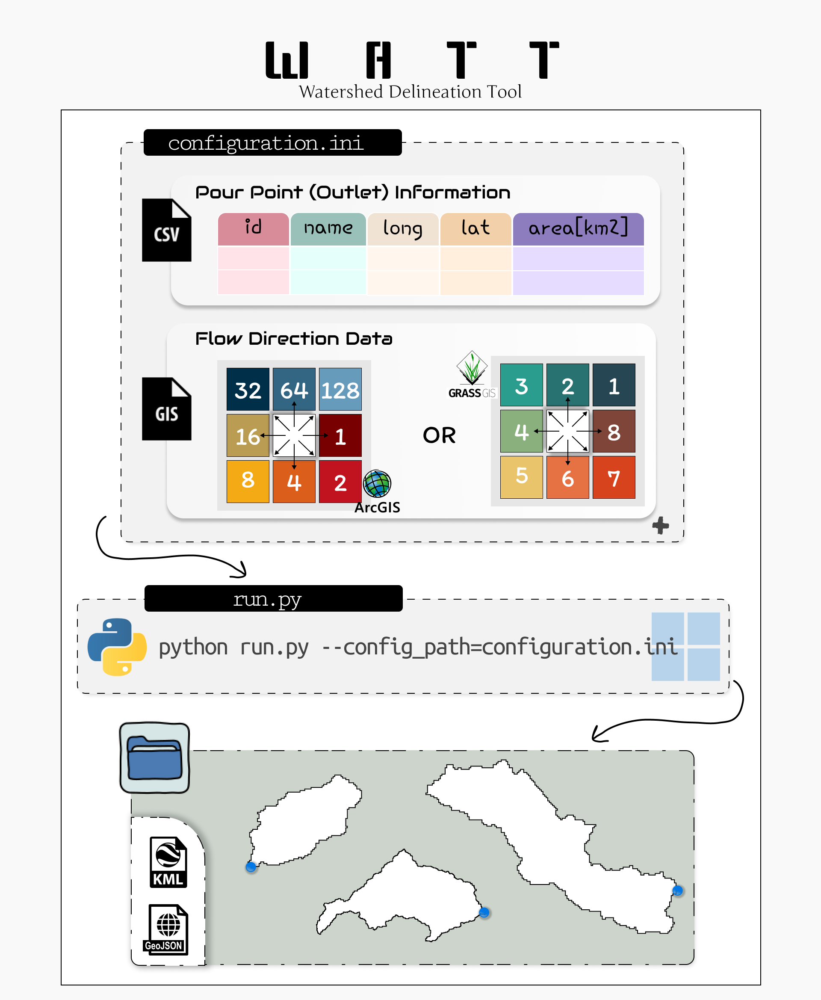
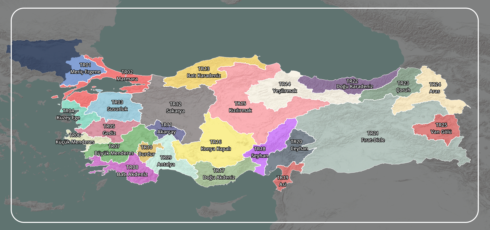

# W A T T

Watershed Delineation Tool :droplet:

Developed for the [Turkish State Hydraulic Services (DSI)](https://www.dsi.gov.tr/).

## Description

This tool facilitates the batch processing of pour points, allowing for the on-demand extraction of drainage areas for multiple points.

This Python package has been specifically designed and tested for delineating watersheds in Turkiye. However, with the provision of the necessary data, it can also be utilized for other locations worldwide.

---



---

## Installation

1. Clone this repository.
1. (Recommended!) Create and activate a virtual environment, using [conda](https://conda.io/projects/conda/en/latest/user-guide/tasks/manage-environments.html#activating-an-environment) or [pip](https://packaging.python.org/en/latest/guides/installing-using-pip-and-virtual-environments/#:~:text=To%20create%20a%20virtual%20environment,virtualenv%20in%20the%20below%20commands.&text=The%20second%20argument%20is%20the,project%20and%20call%20it%20env%20.).
1. Install required libraries.

```sh
pip install -r requirements.txt
```

or

```sh
conda install --file requirements.txt
```

4. Running the code using a user-defined configuration file:

```sh
python run.py --config_path=configuration.ini
```

:arrow_double_down: :arrow_double_down: :arrow_double_down: See examples sections for more details...

## Data

- The examples utilize **MERIT Hydro** dataset (Yamazaki et al., 2019). The data has a 3 arc-second (~90 m) resolution. The drainage direction data in this context employs ArcGIS's flow direction coding, utilizing values that span from 1 to 128. These values correspond to the eight potential flow directions and are structured as powers of 2, progressing in a clockwise fashion :arrows_clockwise: . Notably, the value 1 (or 128) signifies the flow direction towards the east (northeast).

- Throughout this project, I've had the opportunity to test various publicly available Digital Elevation Models (DEMs). It's worth noting that, from my evaluation, the MERIT Hydro dataset stands out as the superior choice. :earth_asia:

### MERIT-Hydro Data for Turkiye

- The drainage direction and flow accumulation data for Turkey's watersheds are organized and readily available in a [Google Drive folder](https://drive.google.com/drive/folders/1ZSKWTHIF7_VplBLWNnf4QNRHmntlNfBf?usp=drive_link). If you're interested in delineating the upstream area of multiple points distributed across Türkiye, feel free to download the folder and explore the WATT tool.



- The river vector data shared in the folder is produced by the General Directorate of Water Management, Turkiye and officially distributed to relevant institutions in 2022. 

## Examples

- Examples are provided in the **'/examples'** folder. Please thoroughly review them and run at least one to test your working environment before proceeding with your data.

  - After cloning the repository and installing the requirements.txt,execute the following script. Ensure that you are in the cloned directory named **_'/path/to/directory/watt-watershed-delineation-tool'_**.

    ```sh
    python run.py --config_path=examples/ex_1/config_ex1.ini
    ```

- :dizzy: Feel free to experiment with the optional parameters in the configuration file—it's highly recommended for a more customized experience!

### Example-1 **[MODE = single]**

- This experiment uses the _single_ mode, which requires drainage data with a .tif extension. While including flow accumulation data (.tif) is at the user's discretion, it can enhance the analysis if available. Additionally, users may provide pre-existing river network vector data in GeoJSON format through the configuration file. Upon calculating the upstream drainage areas for specified pour points, the relevant river network within that delineated region will be intelligently clipped and subsequently stored in the results folder.

### Example-2 **[MODE = partial]**

- If you're dealing with a large raster data that might slow down the WATT tool, you can use the _partial_ mode to lighten the computational load. Essentially, Partial mode in the provided configuration offers a versatile and powerful functionality for hydrological analysis by accommodating multiple pour points across various watersheds. The example provided demonstrates how to use the partial mode efficiently. :heavy_exclamation_mark: To use it, you need a GeoJSON file with watershed borders (each having a unique ID in the attribute table, typically named "Watershed_ID"):heavy_exclamation_mark:. For each watershed, you'll have a corresponding drainage direction data named after its unique ID and with a .tif format. The same naming convention applies to optional flow accumulation data and river network vectors if provided. This experiment serves as a practical illustration of implementing the partial mode, showcasing its versatility in handling complex hydrological analyses involving multiple points and diverse watershed conditions.

## Acknowledgemet

- Prior to initiating this project, I invested time in comprehending the source code available on GitHub at [https://github.com/mheberger/delineator](https://github.com/mheberger/delineator), associated with [Global Watersheds Web App (mghydro)](https://mghydro.com/watersheds/). While this app impressed me with its exceptional speed, user-friendliness, and accuracy, I had to develop a new tool tailored to our specific needs. Although mghydro and WATT share limited similarities, I found inspiration :flashlight: in mghydro's architecture, influencing the shaping of WATT .

- :rocket: ChatGPT :rocket: has played an active role in writing docstrings and enhancing the code. Unfortunately, the ChatGPT sometimes reflects its creators' political biases in its responses, rather than adhering strictly to widely accepted and historical facts (e.g., occupied Palestine). Nevertheless, it remains a useful/powerful tool for writing, reviewing, and documenting code. Use with :warning:.

- Many thanks :tulip: to colleagues at DSI for providing feedback on the accuracy of WATT's outputs.

## Future Work

- An executable (.exe) for this console application.

- A web application would be :gem:!

## References

Yamazaki, D. et al. (2019) ‘Merit hydro: A high‐resolution Global Hydrography Map Based on latest Topography dataset’, Water Resources Research, 55(6), pp. 5053–5073. [doi:10.1029/2019wr024873](doi:10.1029/2019wr024873).

## Licence

MIT
